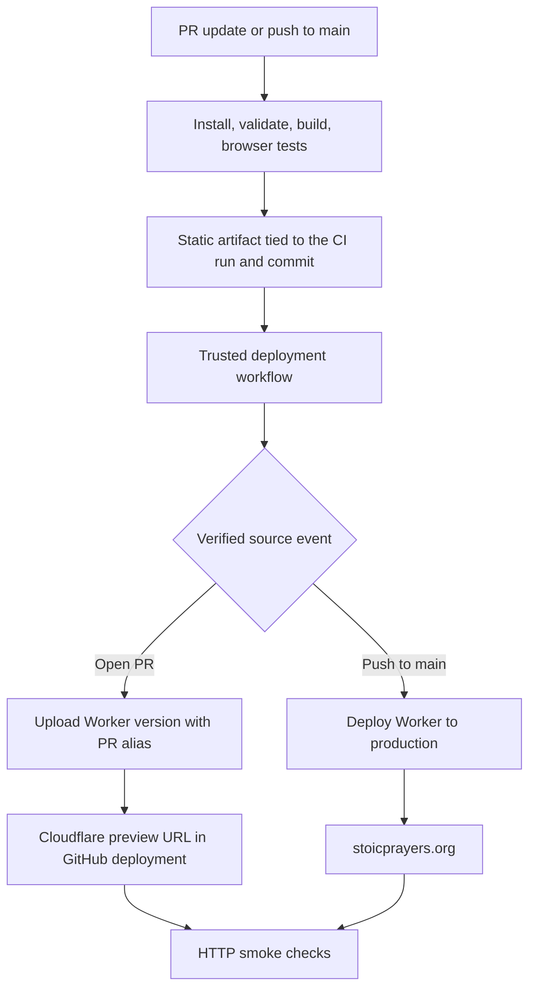

# Stoic prayers: CI and deployment architecture

Proposed architecture for [ariofrio/stoicprayers](https://github.com/ariofrio/stoicprayers), serving https://stoicprayers.org. This document defines the first implementation phase; infrastructure has not been provisioned.

Use **React Router v8 Framework Mode with build-time pre-rendering, GitHub Actions, and Cloudflare Workers Static Assets**. The application needs no request-time server or database. Keep application code, passage data, deployment configuration, and workflows together in the repository.



**Rendering and URLs**

The [attached prototype](/Users/ariofrio/.bb/thread-storage/thr_jemma3viuv/Attachments/stoic-prayers.html) contains 22 passage records in `DATA`, each with an `id`. Its `show()` function currently switches passages in the browser using URL fragments. Preserve those IDs as `/prayers/<id>` routes, with a pre-rendered index at `/`. Preserve old fragment links through a small client-side migration on the index page.

Pin matching React Router packages to `8.3.1` initially: the live npm registry reports it as `latest`, and the [published development package](https://registry.npmjs.org/@react-router/dev/8.3.1) requires Node `>=22.22.0`. Pin a supported Node 24 release and the package manager in the repository; commit the lockfile. Verify the exact versions together when scaffolding.

Use the regular React Router Vite build with explicit pre-render paths. Build-time loaders read committed passage data. Reading and navigation should work before hydration; search, theme, and reading layout enhance the page in the browser. React Router supports static deployment with `ssr: false` and explicit pre-render paths. [Rendering documentation](https://reactrouter.com/how-to/pre-rendering)

```ts
// react-router.config.ts — proposed
import type { Config } from "@react-router/dev/config";
import { prayers } from "./app/content/prayers";

export default {
  ssr: false,
  prerender: ["/", ...prayers.map(({ id }) => `/prayers/${id}`)],
} satisfies Config;
```

Deploy the complete `build/client` directory, including generated navigation data. Generate a sitemap from the same route list and canonical URLs under `https://stoicprayers.org`. Add a standalone `404.html`; unknown paths must return HTTP 404. Configure clean URLs without trailing slashes. Cloudflare supports both settings directly. [Static routing](https://developers.cloudflare.com/workers/static-assets/routing/static-site-generation/), [HTML handling](https://developers.cloudflare.com/workers/static-assets/routing/advanced/html-handling/)

```jsonc
// wrangler.jsonc — proposed, no Worker entry point required
{
  "$schema": "node_modules/wrangler/config-schema.json",
  "name": "stoicprayers",
  "compatibility_date": "2026-09-13",
  "workers_dev": false,
  "preview_urls": true,
  "assets": {
    "directory": "./build/client",
    "html_handling": "drop-trailing-slash",
    "not_found_handling": "404-page"
  },
  "routes": [{ "pattern": "stoicprayers.org", "custom_domain": true }]
}
```

**CI and deployment contract**

| Trigger | Validation | Publication |
| --- | --- | --- |
| PR opened, updated, or reopened against `main` | Build and test the PR merge revision | Upload a version; assign `pr-<number>` alias |
| Push to `main` | Build and test that commit | Deploy the successful artifact to production |
| Failed or superseded build | Record failure or supersession | No deployment |
| PR closed | Mark GitHub preview environment inactive | Stop updating its alias; the last public preview may remain available |

`ci.yml` runs formatting/lint checks, type generation and type checking, focused content tests, the production build, and browser tests served through local Wrangler. Validate unique passage IDs, route coverage, original texts and translations in generated HTML, direct deep links, navigation data, real 404s, mobile navigation, and absence of hydration errors. Run this workflow without Cloudflare secrets and with a read-only GitHub token.

Upload one immutable static artifact after checks pass, with a record of the tested commit and CI run. Avoid fetching translation sources during builds; the committed corpus makes builds reproducible. Cite and audit content separately from deployment.

`deploy.yml` runs from the default branch on successful `workflow_run` completion. It downloads the artifact from that specific run and publishes it without rebuilding. This event supports access to artifacts and deployment secrets, but requires strict separation from untrusted code. [GitHub event documentation](https://docs.github.com/en/actions/reference/workflows-and-actions/events-that-trigger-workflows#workflow_run)

The deployer must validate the originating repository, workflow identity, event, run result, current PR/branch state, and artifact provenance using GitHub metadata. Extract files into a separate directory, reject unsafe paths and symlinks, and enforce upload limits. Use deployment scripts, pinned tooling, and Wrangler configuration from trusted `main`; never execute artifact files, PR scripts, PR configuration, or restored PR caches. This supports same-repository and fork previews after any GitHub-required contributor approval. Restrict the production path to verified `push` events on this repository's `main`.

Use one production deployment concurrency group and one group per PR. Serialize publication, skip superseded runs immediately before publication, and let an in-progress upload finish. This prevents older completed builds from overwriting newer deployments.

**Cloudflare publication**

Production uses pinned Wrangler's `deploy` command. PRs use `versions upload --preview-alias pr-<number>`, which creates a version without promoting it to production. Both use the same asset-only Worker; there are no production data bindings for previews to access. [Cloudflare preview URLs](https://developers.cloudflare.com/workers/versions-and-deployments/preview-urls/)

Each PR gets a stable URL shaped like `https://pr-42-stoicprayers.<account-subdomain>.workers.dev`, plus the version-specific URL for the exact build. Use Wrangler's returned URL in a GitHub Deployment record associated with the tested revision; expose it in the Actions summary as well. PR comments are unnecessary. Preview links are public and are not promised to be permanent archives.

Keep canonical metadata identical in preview and production. Include a host-specific `_headers` rule so Workers preview hosts receive `X-Robots-Tag: noindex` while production remains indexable. This preserves identical deployment bytes. Cache fingerprinted assets for a year with `immutable`; require browser revalidation for HTML and route data. [Cloudflare headers](https://developers.cloudflare.com/workers/static-assets/headers/)

After publication, HTTP-check the returned origin for the index, a passage, its assets/data, an unknown route, and expected indexing headers. Record the Git commit, artifact digest, Cloudflare version ID, and result. A failed smoke check marks the deployment failed; restore the previously recorded production version through an explicit rollback operation, then revert or fix `main` so subsequent CI preserves the correction.

**Repository and initial setup**

```text
app/content/                  Passage records and bibliography
app/routes.ts                 Index and prayer route definitions
app/routes/                   Reader and index UI
public/                       404.html, headers, icons
scripts/                      Artifact validation and deployment helpers
tests/                        Content, routing, and browser checks
.github/workflows/ci.yml       Build and validation
.github/workflows/deploy.yml   Trusted publication and PR-close bookkeeping
react-router.config.ts
vite.config.ts
wrangler.jsonc
docs/deployment.md             Operational instructions and rollback
```

1. Create or obtain access to [ariofrio/stoicprayers](https://github.com/ariofrio/stoicprayers), set `main` as default, and commit the scaffold and workflows. Both authenticated GitHub GraphQL and REST lookups currently fail to resolve the repository; REST returned 404.
2. Confirm the Cloudflare account and active `stoicprayers.org` zone, create the Worker, and enable preview URLs. Attach the apex as a Custom Domain; configure `www.stoicprayers.org` to redirect to the apex while preserving paths and queries. Custom Domains require an active Cloudflare zone. [Custom Domain prerequisites](https://developers.cloudflare.com/workers/configuration/routing/custom-domains/)
3. Store `CLOUDFLARE_ACCOUNT_ID` as a GitHub variable and the deployment API token as a secret. Grant only the account permissions needed for Worker publication; provision DNS/domain changes separately. Pin third-party Actions to full commit SHAs. GitHub officially supports Wrangler deployment with an account ID and API token. [Cloudflare GitHub Actions setup](https://developers.cloudflare.com/workers/ci-cd/external-cicd/github-actions/)
4. Require the CI check before merging to `main`. Keep Cloudflare's separate Git-triggered Builds disabled so GitHub Actions is the sole publisher. Ordinary successful pushes to `main` deploy automatically.
5. Complete one production deployment and one PR preview, then update the PR to verify its stable URL, close it to verify environment bookkeeping, and rehearse rollback. Verify DNS, HTTPS, deep links, HTTP 404s, and preview indexing headers before declaring deployment complete.
